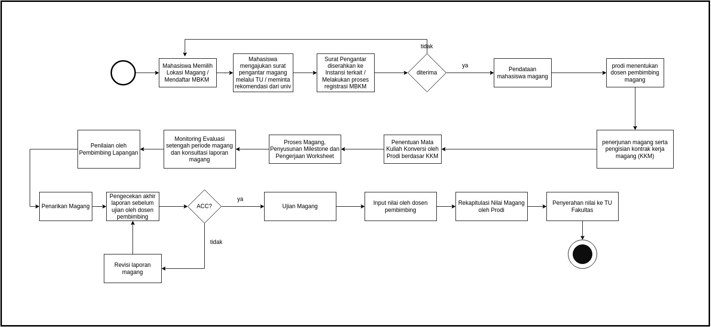

# Panduan Magang 2023

## Pendahuluan

Magang merupakan program pelatihan kerja yang diselenggarakan di sebuah organisasi baik organisasi pemerintah, perusahaan, maupun organisasi kemasyarakatan. Program magang yang diselenggarakan di Program Studi (Prodi) Sistem Informasi UAD merupakan kegiatan akademik yang mengkolaborasikan beberapa mata kuliah menjadi satu kesatuan kegiatan lapangan. Kegiatan lapangan dalam hal ini adalah kegiatan belajar di dunia kerja seperti industri, organisasi pemerintahan, maupun organisasi kemasyarakatan.

## Tujuan
1. Memberikan wawasan kepada mahasiswa mengenai dunia kerja dengan terlibat langsung dalam proses yang terjadi di organisasi.
2. Memberikan kesempatan kepada mahasiswa untuk melakukan pengamatan mengenai peran bidang ilmu Sistem Informasi dalam dunia kerja.
3. Memberikan peluang bagi mahasiswa untuk dapat menemukan permasalahan bidang Sistem Informasi yang terjadi dalam organisasi sehingga diharapkan permasalahan tersebut dapat diangkat menjadi kajian yang lebih mendalam (penelitian) untuk menemukan solusi yang bermanfaat bagi organisasi.

## Timeline Kegiatan

Program magang dilaksanakan mulai 18 Januari 2023 sampai 31 Juli 2023 yang terdiri dari sosialisasi kegiatan dan sharing session magang bersama angkatan 2019, kegiatan pra-magang, kegiatan magang, penyusunan laporan, dan ujian. Pembagian waktu untuk masing-masing kegiatan adalah sebagai berikut:

| Kegiatan        | Tanggal Kegiatan |
| -----------   | ----------- |
| Sosialisasi dan Testimoni Peserta Magang tahun sebelumnya | **18 Januari 2023** |
| Pra Magang |      |
| Penentuan tempat magang | **Februari 2023** <ul type="dash"><li>Pendaftaran Program MBKM: s.d 20 Januari 2023 </li><li>Pendaftaran Magang di Mitra Prodi: Selama Februari 2023</li><li>Pendaftaran Magang di Luar Mitra Prodi: Selama Februari 2023</li></ul> |
| Konversi Mata Kuliah|**1-30 Maret 2023** Mengidentifikasi MK yang belum diambil dan MK yang diulang disesuaikan dengan kegiatan yang dilaksanakan pada saat kegiatan magang.|
| Penerjunan kegiatan magang     | **Minggu Pertama Bulan Maret 2023**     |
| Melakukan kegiatan di tempat magang| **13 Maret 2023 - 8 Juli 2023**  (Durasi minimal 15 Minggu . Pelaksanaan mengikuti kebijakan perusahaan/instansi tempat magang)|
| Penarikan kegiatan magang |**8 Juli 2023** |
| Bimbingan & Penyusunan laporan |**9 - 22  Juli 2023** |
| Pendaftaran Ujian Magang | **19 - 23 Juli 2023**|
| Ujian |**24 - 31 Juli 2023** |

## Kegiatan Pra-Magang

Kegiatan pra-magang merupakan kegiatan persiapan magang untuk mahasiswa. Kegiatan pra-magang terdiri dari kegiatan berikut ini:

| Kegiatan        | Tanggal Kegiatan |
| -----------   | ----------- |
|<i>Workshop problem solving</i>. | **25 Februari 2023** |
|<i>Workshop</i> pengisian <i>worksheet</i> |**25 Februari 2023** |
|<i>Workshop</i> pembuatan <i>milestone</i> kegiatan. | menunggu konfirmasi |
|<i>Workshop</i> penyusunan laporan magang. | menunggu konfirmasi |

## Alur Magang

## Pemilihan Lokasi Magang

Lokasi magang ditentukan secara mandiri oleh masing-masing mahasiswa sesuai dengan minatnya. Pilihan lokasi magang yang dapat diambil oleh mahasiswa antara lain :

### Kegiatan MBKM (MSIB dan Program Bangkit)
Kegiatan-kegiatan Magang dan Studi Independen yang ditawarkan oleh Kampus merdeka. Perusahaan yang dipilih untuk kegiatan magang yang ada hubungannya dengan keilmuan Prodi Sistem Informasi (misal : Analisis Proses Bisnis, Analisis System, Desain Sistem - UI/UX, Implementasi sistem (Back end dan Front end), Pengujian Sistem.

### Perusahaan Rekanan
Perusahaan rekanan adalah perusahaan yang telah menjalin kerjasama secara kelembagaan dengan Program Studi Sistem Informasi. Beberapa perusahaan tersebut adalah:

| Nama Perusahaan        | Website |
| -----------   | ----------- |
|Technophoria Indonesia | [https://technophoria.co.id/](https://technophoria.co.id/) |
|Praxis | [https://www.instagram.com/praxisacademy](https://www.instagram.com/praxisacademy) |
|Mandatech | [https://mandatech-mataram.com/](https://mandatech-mataram.com/) |
|BSI UAD | [https://bsi.uad.ac.id/](https://bsi.uad.ac.id/) |
|Aksaramaya|[https://aksaramaya.com/](https://aksaramaya.com/)|
|Symbolic|[https://symbolic.id/](https://symbolic.id/)|
|Seven Inc||
|Ruang Ekspresi |[https://ruang-ekspresi.id/](https://ruang-ekspresi.id/)|
|CariJamu|[https://www.carijamu.id/](https://www.carijamu.id/)|

###  Perusahaan yang mempunyai Departemen IT
Perusahaan yang bergerak di bidang apapun dan mempunyai Departemen IT.

### Pemerintahan, Dinas Kominfo
Dinas Kominfo di seluruh Indonesia

## Surat Pengantar Magang
Surat pengantar magang saat ini dapat dibuat melalui pengisian form secara online melalui [link berikut](https://docs.google.com/forms/d/1_9Mx2pYsKBl50we6CP9ZbDplE0NDyC3ZVMxU0OsEYRI/viewform?edit_requested=true), dan mengambil hardcopy di lantai 8 atau unduh melalui link [drive](https://s.uad.id/PDF-SuratIjin-Penelitian-KP-Magang) berikut.

## Registrasi Magang
Registrasi magang dilakukan oleh mahasiswa yang sudah diterima oleh perusahaan / mitra magang, dinkominfo, MBKM, MSIB, ataupun lokasi magang lain yang bertujuan untuk pendataan program studi. Registrasi dapat diisi melalui link berikut : [registrasi_magang](https://docs.google.com/forms/d/e/1FAIpQLSe6sb5mPTbKTkcjltB447FVqoOz45Kl5DBUwWoiTF8vNV79qA/viewform?usp=sf_link)

## Penentuan Dosen Pembimbing
Penentuan Dosen Pembimbing dilakukan setelah mahasiswa mengisi form pendataan bahwa telah diterima di MBKM, MSIB, ataupun perusahaan. Penentuan dosen pembimbing juga disesuaikan dengan jenis proyek yang akan dikerjakan oleh mahasiswa selama proses magang berlangsung.

## Penerjunan dan Koordinasi Lapangan

Penerjunan dilaksanakan pada pekan awal Maret 2023. Penerjunan didampingi langsung oleh dosen (jika lokasi magang berada di lingkup DIY) atau dilaksanakan serempak secara daring. Pada kegiatan penerjunan ini, dosen mendata terkait scope of project dari masing-masing mahasiswa guna penentuan konversi mata kuliah.

## Penentuan Mata Kuliah Konversi
Ditentukan berdasarkan scope of projects dari mahasiswa yang melaksanakan magang. Jumlah mata kuliah dapat berbeda berdasarkan kompleks nya projek yang dikerjakan mahasiswa selama kegiatan magang (maksimal 20sks).

## Penyusunan Milestones Kegiatan
[perlu contoh milestones dan task dalam spreadsheet]

## Monitoring dan Evaluasi

Monitoring dan Evaluasi (Monev) dilaksanakan sekali di pertengahan kegiatan magang bersama dosen pembimbing masing-masing guna mengetahui progress kegiatan dari mahasiswa, kendala yang dialami selama magang, atau apapun yang dapat ditindaklanjuti oleh dosen pembimbing maupun program studi.

## Penyusunan Laporan
Penyusunan laporan dapat dilakukan pada pekan terakhir kegiatan magang. Laporan berisi tentang log book selama kegiatan magang, dan milestone proyek selama magang. Laporan dapat dikonsultasikan dengan dosen pembimbing. Apabila telah mendapat persetujuan oleh pembimbing, mahasiswa dapat mendaftar ujian magang. Format laporan dapat disalin melalui [link](https://docs.google.com/document/d/1U9G8ohUeVGD3szTMzyohNIDLF1iwQ5QK-geF2OQYygo/edit) berikut.

## Worksheet Magang
Worksheet magang merupakan kumpulan lembar kerja yang harus dikerjakan oleh mahasiswa setelah prodi menentukan mata kuliah yang akan di konversi tiap individu. Worksheet ini sebagai salah satu komponen penilaian yang akan diakumulasikan di akhir proses magang nanti. Data worksheet tiap mata kuliah dapat dilihat pada menu worksheet pada sidebar.

## Pengumpulan Worksheet
Worksheet akan dikumpulkan sesuai dengan mata kuliah masing-masing melalui google classroom. Link tiap GC akan di distribusikan melalui email uad masing-masing.

## Penilaian
Penilaian magang digunakan untuk menentukan nilai mata kuliah yang dikonversi pada kegiatan magang periode ini. Penentuan nilai berdasarkan hasil dari worksheet yang dirangkum dalam sebuah rubrik nilai. Contoh rubrik nilai sebagai berikut : 

[Rubrik Penilaian Sistem Enterprise](https://docs.google.com/spreadsheets/d/1iJ8WUmn4YMfs7Iij2po-3OOyEpmBJaOE4fu-gbfAtQ4/edit?usp=sharing)

## Diseminasi Hasil Magang
Diseminasi hasil magang merupakan tahap akhir dari proses magang dimana mahasiswa menyampaikan hasil magang kepada dosen penguji untuk mempertanggungjawabkan kegiatan yang sudah dilakukan / dikerjakan selama masa magang. 

## Penutup
Panduan ini merupakan petunjuk umum pelaksanaan program magang Prodi Sistem Informasi UAD. Anda dapat menghubungi kontak email jika terdapat hal-hal teknis yang belum dijelaskan pada panduan ini.
